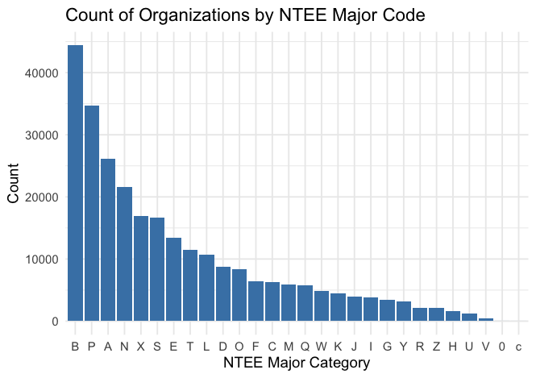
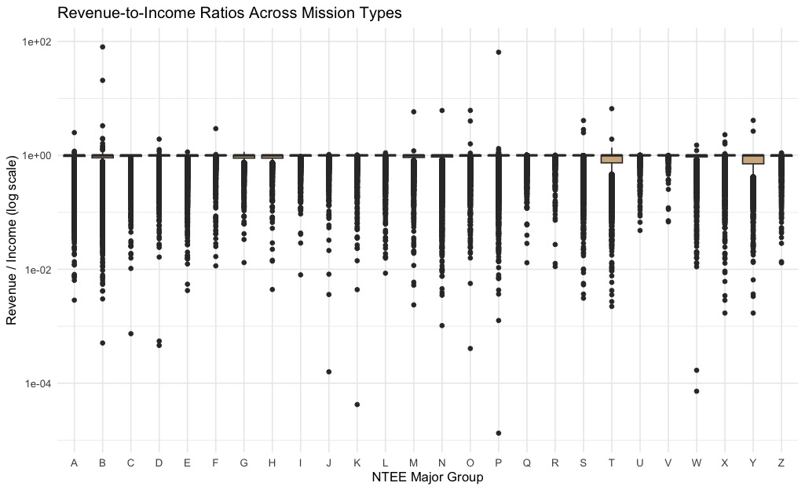
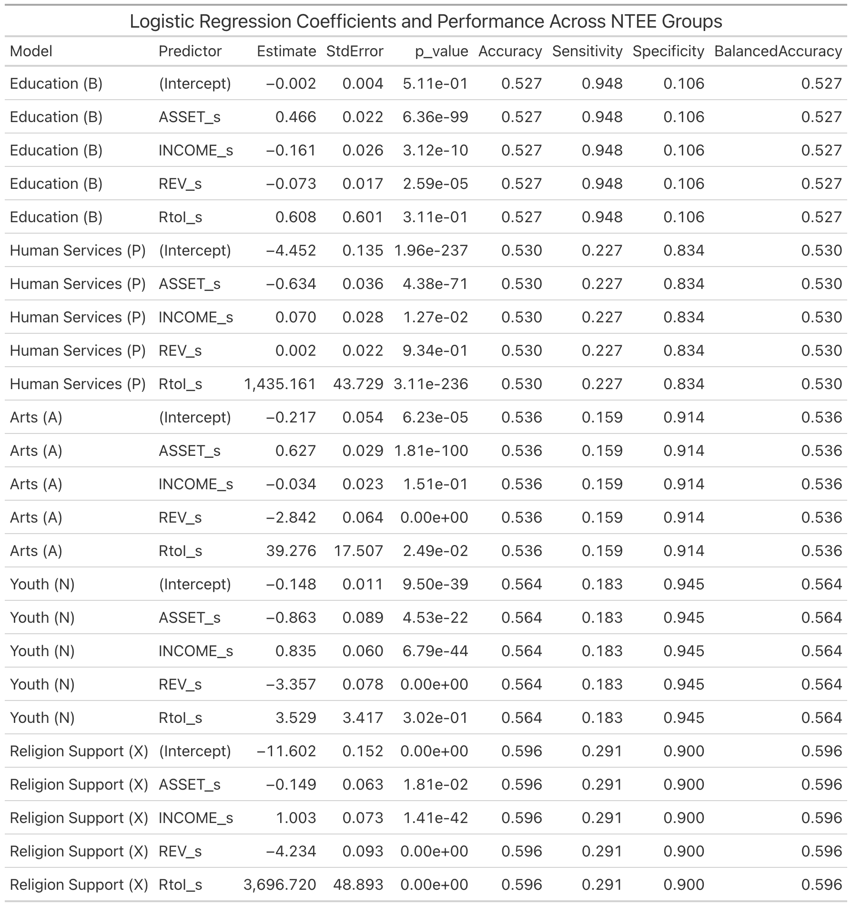
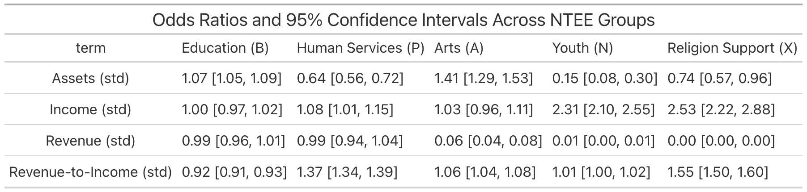
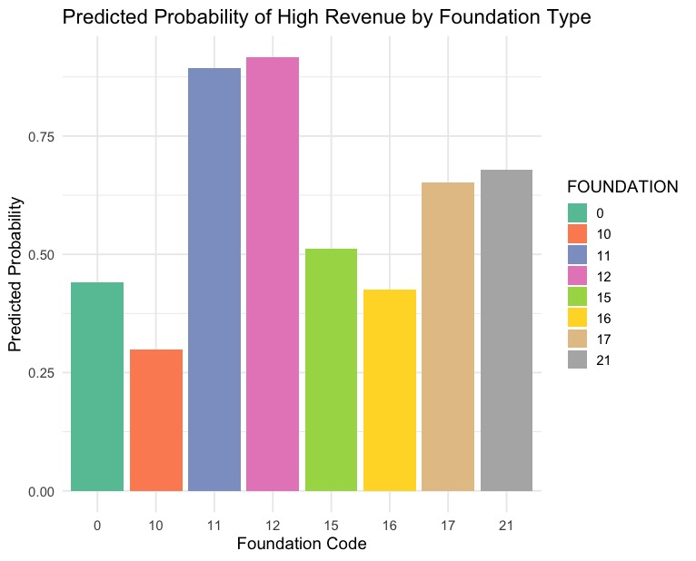
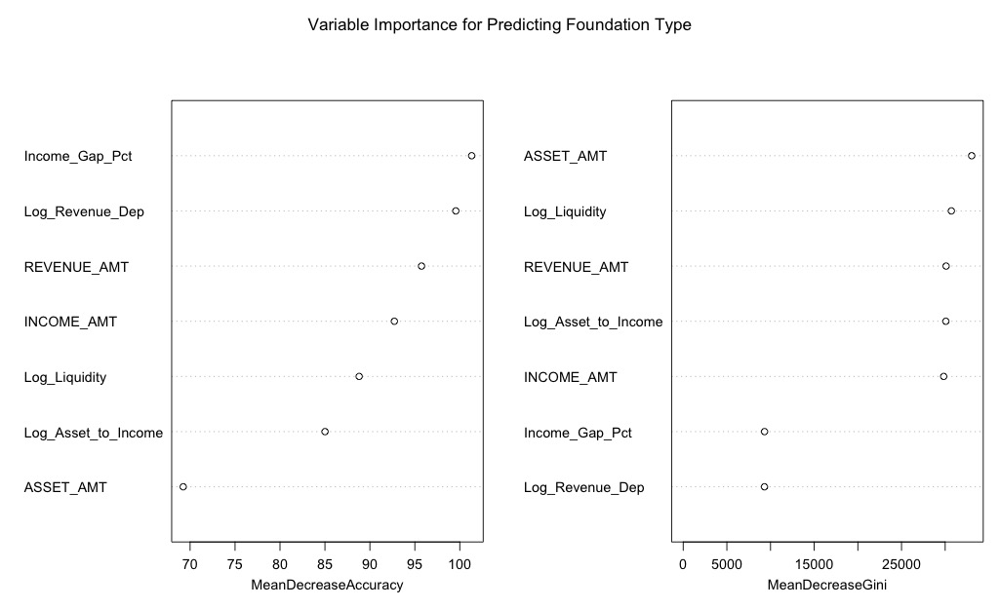

### Abstract 

*This study examines how organizational characteristics and financial indicators relate to revenue outcomes and mission classifications among United States nonprofits. Using the 2024 IRS Exempt Organizations Business Master File, we analyze more than 360,000 tax-exempt organizations. Logistic regression, random forests, multinomial models, and exploratory data analysis show that assets and revenue are the strongest predictors of high income status, state-level geography contributes modest but statistically significant variation, mission categories differ systematically in their financial profiles, and financial indicators provide moderate predictive power for foundation classification. These findings highlight meaningful structural financial differences across the nonprofit sector and provide insight into the determinants of organizational scale and mission alignment.*

### Introduction

Tax-exempt organizations receive federal tax benefits in exchange for providing public services such as charity, education, and healthcare. This study investigates how organizational classifications and financial characteristics influence revenue, income, and assets among United States nonprofits. Data were obtained from the IRS Exempt Organizations Business Master File. Descriptive analyses and regression models were used to examine financial patterns and identify predictors of high organizational income.

### Methods 

To prepare the dataset for analysis, we applied several techniques covered in class. Exploratory data analysis was used to assess skew, missing values, and category imbalance. To create more interpretable predictors, we engineered financial structure ratios including asset to income, revenue dependence, and liquidity. These ratios were then log transformed to reduce skew and stabilize variance. Standardization was applied to continuous predictors before modeling. For classification tasks, we used logistic regression and random forest models, and oversampling techniques were applied to address class imbalance. These steps allowed us to analyze financial determinants of organizational outcomes using consistent and well-structured variables.

### Question 1

  

#### To what extent do standardized financial indicators predict whether an organization belongs to top NTEE mission categories?

Exploratory analysis shows substantial variation in asset and income levels across mission types. For example, organizations in Education and Health tend to have higher median assets and income, while organizations in categories such as Arts or Youth display narrower distributions and smaller financial footprints. These patterns indicate that nonprofit sectors vary systematically in operational scale.

The revenue-to-income ratio, which reflects financial structure, also varies across mission groups. While many categories cluster around similar median values, the distributions within categories are wide, showing diverse funding models even among organizations with similar missions. Some groups display long right-tail distributions, indicating subgroups with unusually high revenue performance relative to income.

These exploratory patterns demonstrate clear differences across mission categories and support the inclusion of financial indicators in later predictive modeling.

To further examine these relationships, logistic models were fit for the five largest NTEE groups using standardized financial variables. Odds ratios and confidence intervals highlight consistent and interpretable financial distinctions among mission categories. Accuracy results after oversampling show moderate predictive performance across groups.

{width="800"}
 

{width="800"}

 

{width=800}

 

{width="800"}

 

{width="1500"}

 

{width="1200"}

{width="1200"}

{width="1200"}

### Question 2
#### To what extent do financial indicators predict foundation classification type?
H₀₄: Financial indicators (assets, income, liquidity, revenue dependence, revenue-to-income ratio) do not predict foundation type.

H₁₄: At least one financial indicator significantly predicts foundation type.

Binary logistic regression models were fit for the five most common NTEE categories. All financial variables were standardized before modeling to improve interpretability. Oversampling was used to correct class imbalance prior to model evaluation.

The models show that financial characteristics have significant relationships with foundation type. Standardized income and revenue are strong positive predictors for categories such as Education and Human Services. The revenue-to-income ratio also plays an important role for several groups, indicating that financial structure, not just size, contributes to classification. Foundation types coded 11 and 12 show particularly high predicted probabilities of being high revenue, while types 10 and 16 show considerably lower probabilities.

An additional logistic regression model examining high revenue outcomes demonstrates that both financial indicators and foundation type contribute meaningfully to predicting high revenue status. Odds ratios show that revenue dependence and income gap percentage are among the strongest continuous predictors. Several foundation types have odds ratios well above one, indicating higher likelihood of high revenue relative to the reference category.

Random forest variable importance measures confirm the predictive roles of liquidity, revenue dependence, asset-to-income ratios, and other financial structure metrics. These measures appear more influential than raw financial size indicators, suggesting that foundation type is closely tied to patterns of financial management rather than total financial magnitude.

{width="1200"}

  

 Predicting High Revenue.jpeg){width="1200"}

  

{width="1200"}

### Results and Discussion

This study evaluated whether financial characteristics such as assets, income, revenue, and revenue-to-income ratio help differentiate nonprofit mission categories and foundation types. Across all logistic and random forest models, financial indicators showed consistent and interpretable effects.

Assets were especially important for Education and Arts organizations, reflecting long-term financial capacity and investment structures. Income was a strong predictor for Youth and Religion Support organizations, indicating greater reliance on recurring financial inflows. The revenue-to-income ratio distinguished Human Services and Religion Support groups, suggesting differences in operational dependence on revenue relative to reported income.

While revenue is highly skewed, standardization improved its interpretability and allowed it to contribute meaningfully across models. Overall, mission categories and foundation types each showed distinct financial signatures, reflecting systematic differences in financial behavior, capacity, and structure across nonprofit sectors.

### Conclusion

Financial characteristics partially explain nonprofit mission types and foundation classifications. Assets, income, and revenue-to-income ratios consistently differentiate major NTEE groups, while measures of financial structure such as liquidity and revenue dependence strongly contribute to foundation classification. Education and Arts organizations tend to have greater asset holdings, while Youth and Religion Support organizations rely more on income flows. Human Services organizations show distinctive revenue-to-income patterns, likely reflecting the nature of service-oriented operations.

Although financial data do not capture the full complexity of nonprofit missions, the patterns identified in this analysis demonstrate that financial indicators provide meaningful insight into nonprofit behavior and classification. Future work could incorporate multi-year financial trends, geographic variation, or additional organizational attributes, but the present results establish a strong foundation for understanding financial differences across the nonprofit landscape.

### Future Scope

Future work could extend this analysis in several meaningful directions. First, incorporating multi-year IRS filings would allow researchers to study financial trends over time, making it possible to identify growth trajectories, organizational stability, and revenue shocks. Second, geographic analysis could be expanded beyond state-level comparisons to include county or zip code socioeconomic indicators, which may offer more precise insight into environmental factors that shape nonprofit financial outcomes. Third, mission classification models could be improved by integrating textual data from mission statements or Form 990 descriptions to capture organizational purpose more directly than financial variables alone. Finally, additional machine learning approaches, such as gradient boosting or neural models, may enhance predictive accuracy and reveal nonlinear relationships not fully captured by logistic regression or random forests.

 
